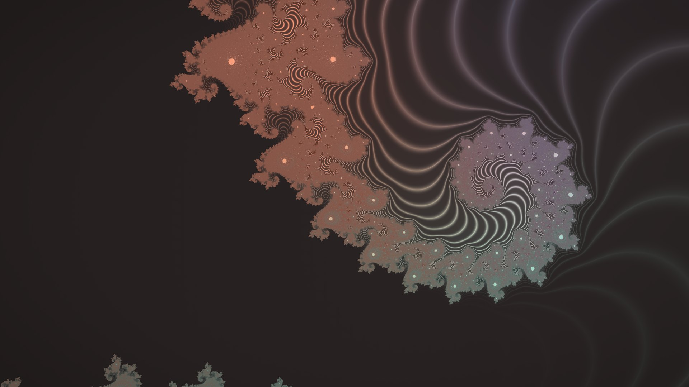
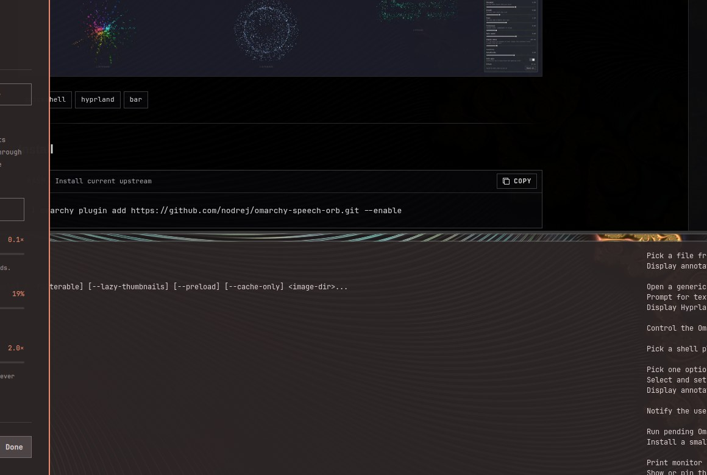
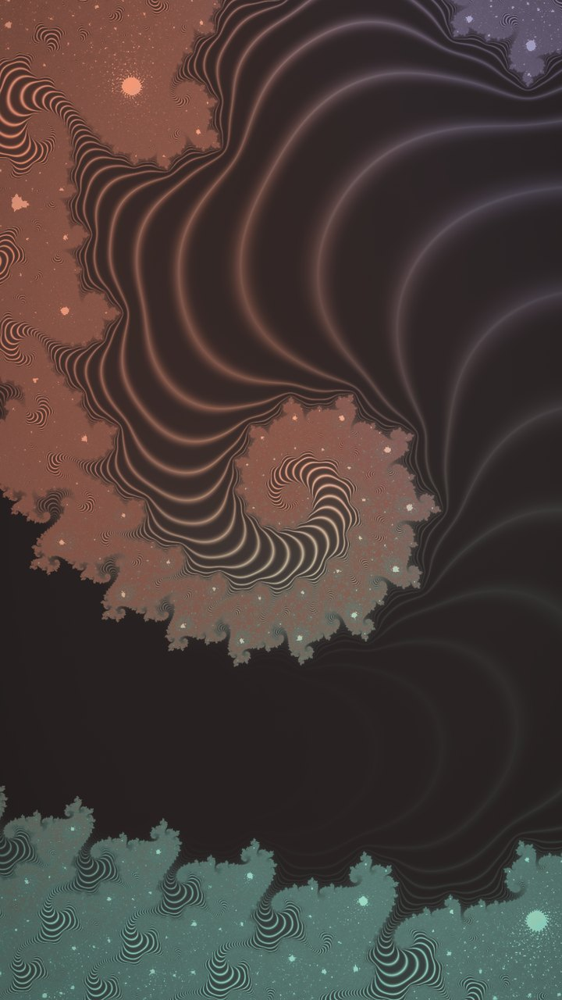

# Filigree

An animated fractal wallpaper for [Omarchy](https://omarchy.org) — a Quickshell
plugin (`ric.background`) that fills your screens with drifting fractal
engravings: gold wire traced along the grooves of the Mandelbrot set and its
neighbours, dissolving through a zoom cycle of ever-finer lace.

The wire is never a hand-drawn stroke — it is the fractal's own
self-similar structure, so the picture keeps revealing new lace at every
zoom level.

Colors are drawn from your current theme.

<p align="center">
  
</p>

<p align="center"><em>Filigree on a real 4K display.</em></p>

<p align="center">
  
</p>

<p align="center"><em>The studio — every setting is live: composition, motion, the gold wire,
and <a href="#current-version">finest detail</a> (satin), previewed against a real-time render.</em></p>

## Current version

**3.4.0** — adds *Finest detail*: lace finer than a pixel you choose is lit
as a soft satin sheen instead of one-pixel glints, so dense areas shimmer
instead of crawling.

## Layout

- `manifest.json` — the root manifest used by `omarchy plugin add` and validation.
- `plugin/` — the Omarchy plugin: QML (background, fractal renderer, studio),
  GLSL shaders + prebuilt `.qsb` files, the `fractal` CLI, and the
  user-facing `plugin/README.md`.
- `HANDOFF.md` — engineering log: architecture notes, calibration history,
  and the measured costs/benefits of each feature.

## Screenshots

<table>
<tr>
<td width="50%">
  <br>
  <em>Trinity (z³ + c) mid-blend — the fractal cross-fades to the next zoom level — detail&nbsp;2.</em>
</td>
<td width="50%">
  <br>
  <em>Zoom dissolve, detail&nbsp;4 — the outgoing view dissolves as the fractal rolls over to finer lace.</em>
</td>
</tr>
<tr>
<td width="33%">
  <br>
  <em>Julia lace preset (3.3.0 render, pre-satin).</em>
</td>
<td width="33%">
  <br>
  <em>Mandelbrot atlas preset (3.3.0 render, pre-satin).</em>
</td>
<td width="33%">
  <br>
  <em>Portrait-orientation display.</em>
</td>
</tr>
</table>

## Installing

```sh
omarchy plugin add https://github.com/keylimesoda/filigree
```

Then open the Filigree studio (the plugin's bar entry) or drive it from a
terminal. The CLI is not automatically added to `PATH`; use its installed path:

```sh
~/.config/omarchy/plugins/ric.background/plugin/fractal --help
~/.config/omarchy/plugins/ric.background/plugin/fractal set wire 1.5
~/.config/omarchy/plugins/ric.background/plugin/fractal set detail 3
~/.config/omarchy/plugins/ric.background/plugin/fractal status
```

## Requirements

- Omarchy (Hyprland + the Omarchy shell, Quickshell ≥ 0.3)
- The shader binaries checked in are built with
  `qsb '150,300 es'`; from the repository root, re-run
  `plugin/build-shaders` to rebuild from the `.frag` sources during development.
