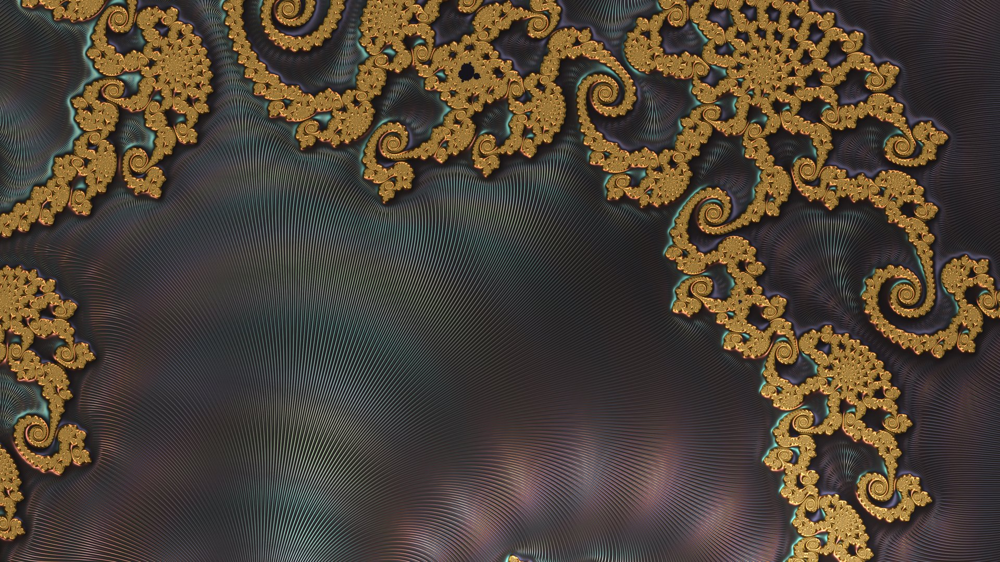
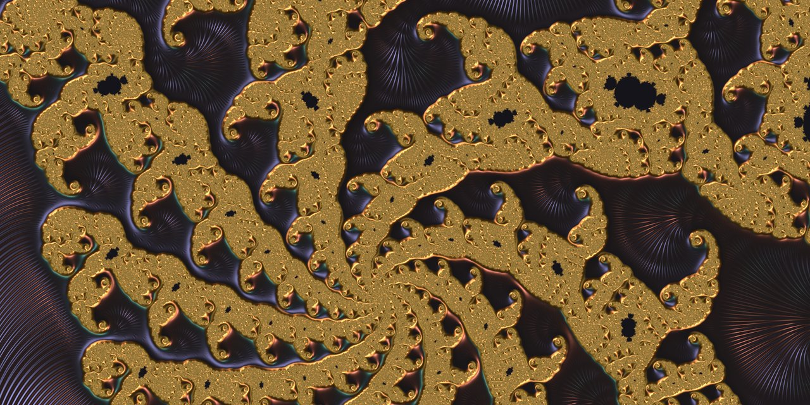
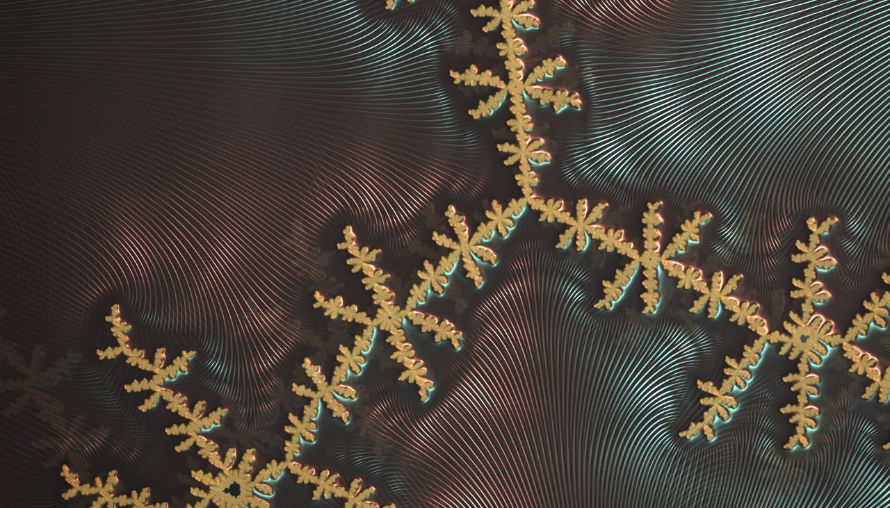
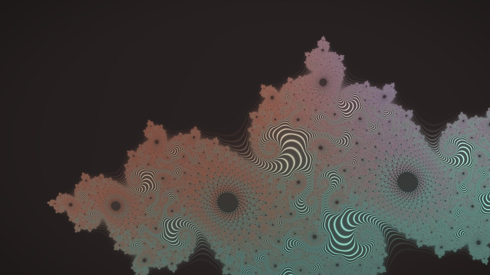
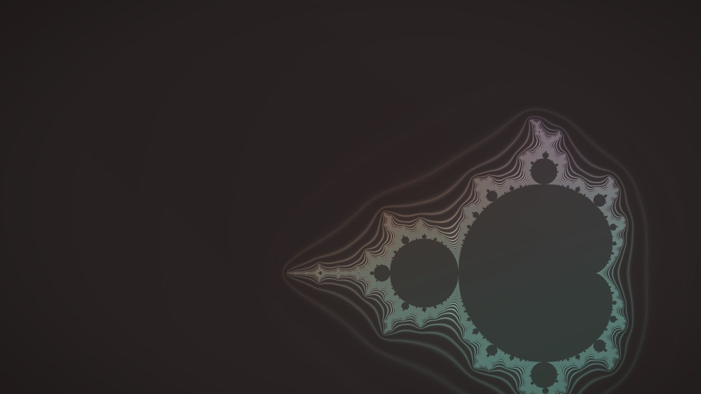
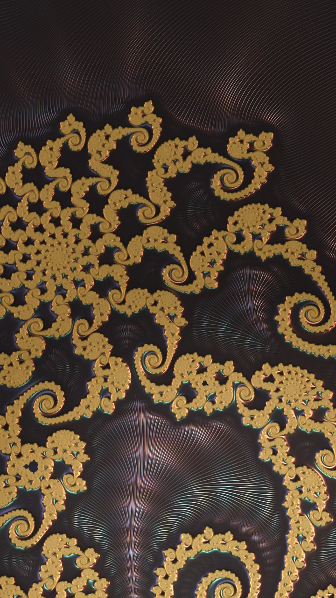

# Filigree

An animated fractal wallpaper for [Omarchy](https://omarchy.org) — a Quickshell
plugin (`ric.background`) that fills your screens with drifting fractal
engravings: gold wire traced along the grooves of the Mandelbrot set and its
neighbours, dissolving through a zoom cycle of ever-finer lace.

The wire is never a hand-drawn stroke — it is the fractal's own
self-similar structure, so the picture keeps revealing new lace at every
zoom level.

<p align="center">
  
</p>

<p align="center"><em>The wallpaper on a real 4K display: Seahorse Valley, detail&nbsp;2 (satin).</em></p>

## Current version

**3.4.0** — adds *Finest detail*: lace finer than a pixel you choose is lit
as a soft satin sheen instead of one-pixel glints, so dense areas shimmer
instead of crawling.

## Layout

- `plugin/` — the Omarchy plugin: QML (background, fractal renderer, studio),
  GLSL shaders + prebuilt `.qsb` files, the `omarchy-fractal` CLI, and the
  user-facing `plugin/README.md`.
- `HANDOFF.md` — engineering log: architecture notes, calibration history,
  and the measured costs/benefits of each feature.

## Screenshots

<table>
<tr>
<td width="50%">
  <br>
  <em>Trinity (z³ + c) mid-blend — the fractal cross-fades to the next zoom level — detail&nbsp;2.</em>
</td>
<td width="50%">
  <br>
  <em>Zoom dissolve, detail&nbsp;4 — the outgoing view dissolves as the fractal rolls over to finer lace.</em>
</td>
</tr>
<tr>
<td width="33%">
  <br>
  <em>Julia lace preset (3.3.0 render, pre-satin).</em>
</td>
<td width="33%">
  <br>
  <em>Mandelbrot atlas preset (3.3.0 render, pre-satin).</em>
</td>
<td width="33%">
  <br>
  <em>Portrait-orientation display, detail&nbsp;4.</em>
</td>
</tr>
</table>

## Installing

```sh
# 1. Get the plugin into your Omarchy plugin directory
rsync -a --exclude Background.v1.qml plugin/ ~/.config/omarchy/plugins/ric.background/

# 2. (Only if you edit shaders) rebuild the compiled shaders
plugin/build-shaders

# 3. Restart the shell so it picks the plugin up
omarchy restart shell
```

Then open the Filigree studio (the plugin's bar entry) or drive it from a
terminal:

```sh
omarchy-fractal --help      # every setting, its range and default
omarchy-fractal set wire 1.5
omarchy-fractal set detail 3
omarchy-fractal status
```

## Requirements

- Omarchy (Hyprland + the Omarchy shell, Quickshell ≥ 0.3)
- The shader binaries checked in are built with
  `qsb '150,300 es'`; re-run `plugin/build-shaders` to rebuild from the
  `.frag` sources.